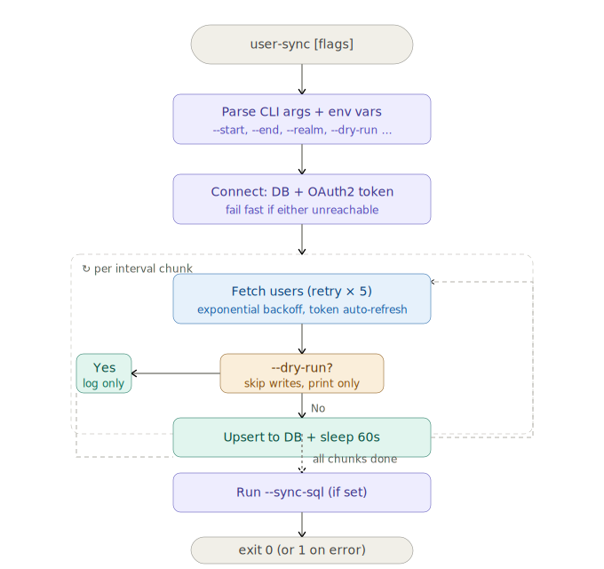

# user-sync

A one-shot CLI tool that pulls user records from a remote user service and upserts them into a PostgreSQL database. Designed to be driven by any external scheduler (system cron, Kubernetes CronJob, CI pipeline, etc.).

## Process flow



Each run fetches users over a configurable time window, splits it into manageable chunks, upserts every record, and exits with a standard exit code — `0` on success, `1` if any errors occurred.

## Project structure

```
user-sync/
├── src/
│   ├── main.rs        # Entry point: parse args, wire deps, run once, exit
│   ├── cli.rs         # CLI argument definitions (clap + env-var fallback)
│   ├── sync.rs        # Orchestrator: chunked loop, dry-run, summary
│   ├── api.rs         # HTTP client with retry + exponential backoff
│   ├── token.rs       # OAuth2 client-credentials token cache
│   ├── db.rs          # PostgreSQL upsert via sqlx
│   └── models.rs      # API response types and DB row struct
├── migrations/
│   └── 0001_create_global_users.sql
├── docs/
│   └── flow.svg       # Process flow diagram
├── Cargo.toml
├── .env.example
└── README.md
```

## Prerequisites

- Rust 1.75+ (`rustup update stable`)
- PostgreSQL 13+
- Network access to the user service OAuth2 endpoint

## Quick start

```bash
# 1. Clone and enter the project
git clone <repo-url>
cd user-sync

# 2. Copy and fill in the environment file
cp .env.example .env
$EDITOR .env

# 3. Build a release binary
cargo build --release

# 4. Preview what would be written (no DB writes)
./target/release/user-sync --dry-run

# 5. Run for real
./target/release/user-sync
```

## Configuration

Every option can be set as a CLI flag **or** an environment variable. CLI flags take precedence. A `.env` file in the working directory is loaded automatically when present.

| Flag | Env var | Default | Description |
|---|---|---|---|
| `--user-endpoint` | `USER_ENDPOINT` | *(required)* | User service base URL |
| `--token-url` | `TOKEN_URL` | *(required)* | OAuth2 token endpoint |
| `--client-id` | `CLIENT_ID` | *(required)* | OAuth2 client ID |
| `--client-secret` | `CLIENT_SECRET` | *(required)* | OAuth2 client secret |
| `--database-url` | `DATABASE_URL` | *(required)* | PostgreSQL connection string |
| `--start-interval` | `START_INTERVAL` | `30` | Days back for earliest window |
| `--end-interval` | `END_INTERVAL` | `0` | Days back for latest window (0 = today) |
| `--interval-limit` | `INTERVAL_LIMIT` | `7` | Max days per API request chunk |
| `--chunk-sleep-secs` | `CHUNK_SLEEP_SECS` | `60` | Sleep between chunks (rate-limit guard) |
| `--include-realm-types` | `INCLUDE_REALM_TYPES` | *(all)* | Filter by realm type |
| `--sync-sql` | `SYNC_SQL` | *(none)* | Optional SQL to run after sync |
| `--http-timeout-secs` | `HTTP_TIMEOUT_SECS` | `600` | HTTP request timeout |
| `--dry-run` | — | `false` | Fetch only; skip all DB writes |
| `-q` / `--quiet` | — | `false` | Suppress progress output |

Run `user-sync --help` to see the full usage at any time.

## Usage examples

```bash
# Full sync using values from .env
user-sync

# Override the window inline
user-sync --start-interval 7 --end-interval 0

# Filter to a specific realm
user-sync --include-realm-types INTERNAL

# Dry run — prints what would be upserted, no writes
user-sync --dry-run

# Silent mode — only errors go to stderr (useful in cron)
user-sync --quiet

# Check exit code in a shell script
user-sync --quiet && echo "OK" || echo "FAILED — check logs"
```

## Scheduling

`user-sync` is a plain process: run it from any scheduler.

**System cron** (`crontab -e`):
```cron
# Every day at 02:00
0 2 * * * /usr/local/bin/user-sync --quiet >> /var/log/user-sync.log 2>&1
```

**Kubernetes CronJob**:
```yaml
apiVersion: batch/v1
kind: CronJob
metadata:
  name: user-sync
spec:
  schedule: "0 2 * * *"
  jobTemplate:
    spec:
      template:
        spec:
          restartPolicy: OnFailure
          containers:
            - name: user-sync
              image: your-registry/user-sync:latest
              envFrom:
                - secretRef:
                    name: user-sync-secrets
```

**systemd timer** (`/etc/systemd/system/user-sync.timer`):
```ini
[Unit]
Description=Daily user sync

[Timer]
OnCalendar=*-*-* 02:00:00
Persistent=true

[Install]
WantedBy=timers.target
```

## Retry behaviour

Each API chunk is retried up to 5 times with exponential backoff:

| Attempt | Wait before retry |
|---|---|
| 1 | 2 s |
| 2 | 4 s |
| 3 | 8 s |
| 4 | 16 s |
| 5 | 30 s (capped) |

Each wait is jittered ±20% to avoid thundering-herd on the user service. If all 5 attempts fail, the chunk is skipped and the final exit code is `1`.

## Token management

The OAuth2 token is fetched once at startup using the `client_credentials` grant. It is cached in memory and automatically refreshed 60 seconds before expiry, so long-running syncs spanning many chunks never hit token expiration mid-run.

## Building a Docker image

```dockerfile
FROM rust:1.78-slim AS builder
WORKDIR /app
COPY . .
RUN cargo build --release

FROM debian:bookworm-slim
RUN apt-get update && apt-get install -y ca-certificates && rm -rf /var/lib/apt/lists/*
COPY --from=builder /app/target/release/user-sync /usr/local/bin/user-sync
ENTRYPOINT ["user-sync"]
```

```bash
docker build -t user-sync .
docker run --env-file .env user-sync --dry-run
```

## Logging

Set `RUST_LOG` to control verbosity:

```bash
RUST_LOG=user_sync=debug,sqlx=warn user-sync   # verbose
RUST_LOG=user_sync=info                         # default
RUST_LOG=error                                  # errors only
```

## Database schema

The migration in `migrations/0001_create_global_users.sql` is applied automatically on every run before the sync begins. It is idempotent (`CREATE TABLE IF NOT EXISTS`).

```sql
CREATE TABLE IF NOT EXISTS global_users (
    pccuid        NUMERIC(20, 0) PRIMARY KEY,
    id            NUMERIC(20, 0) NOT NULL,
    sso_acct      VARCHAR(50)    NOT NULL,
    -- ... (see migration file for full schema)
);
```

## Exit codes

| Code | Meaning |
|---|---|
| `0` | All users synced successfully |
| `1` | One or more upsert errors, or a fatal startup error |

## License

MIT
